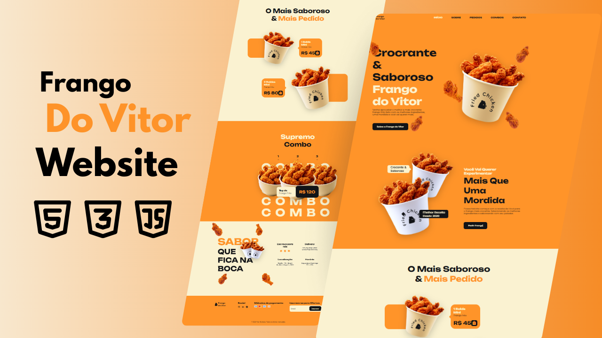

## 🍗 Frango do Vitor - Website Responsivo

Landing Page moderna para restaurante especializado em frango frito, desenvolvida com foco em responsividade e boas práticas de front-end.


## ✨ Destaques do Projeto

- **Design 100% responsivo** (mobile, tablet, desktop)
- **Navegação suave** entre seções
- **Animações** com ScrollReveal.js
- **Ícones modernos** com Remix Icon
- **Performance otimizada**

## 🛠️ Tecnologias Utilizadas

| Tecnologia | Utilização |
|------------|------------|
| HTML5 | Estrutura semântica |
| CSS3 | Estilização e responsividade |
| JavaScript | Interatividade e funcionalidades |
| ScrollReveal | Animações ao scroll |
| Remix Icon | Biblioteca de ícones |

## 🚀 Como Executar

1. **Clone o repositório:**
   ```bash
   git clone https://github.com/Vitorbarbosa-dev/Frango-Do-Vitor-website.git

2. **Acesse a pasta do projeto:**
    ```bash
    cd Frango-Do-Vitor-website
3. **Abra no navegador:**
    ```bash
    #Simplesmente abra o aquivo index.html no seu navegador
---
## 🌐 Site Online

[](https://vitorbarbosa-dev.github.io/Frango-Do-Vitor-website/)

🔗 **https://vitorbarbosa-dev.github.io/Frango-Do-Vitor-website/**


## 📸 Preview do Projeto



## 📋 O que Aprendi
**Este projeto me permitiu praticar:**

- Estrutura HTML semântica.

- CSS Grid e Flexbox na prática.

- Media queries para responsividade.

- JavaScript para interações.

- Controle de versão com Git.

## 🔮 Próximas Melhorias

- Implementar modo claro/escuro
- Adicionar mais interatividade JavaScript
- Conectar formulário a backend
- Otimizar performance para mobile

## 👨‍💻 Autor
Vitor Barbosa - Estudante de ADS em busca de estágio
